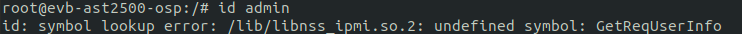
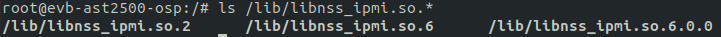
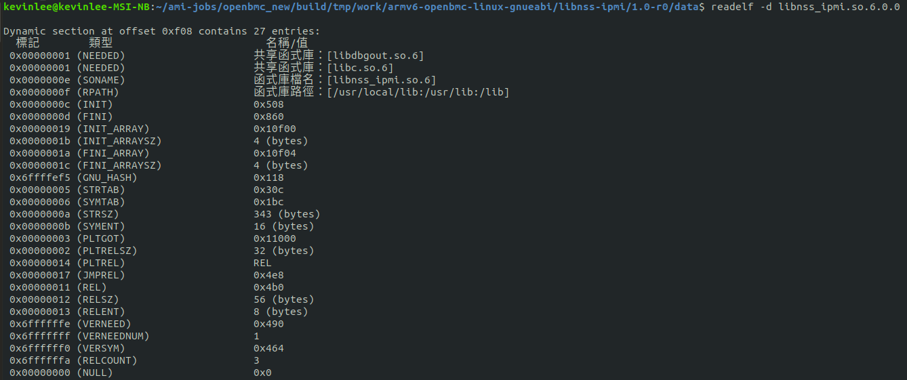
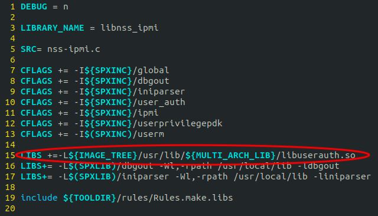

當執行程式時，呼叫到動態函式庫時，發生undefined symbol錯誤



主要是libnss_ipmi.so.2會呼叫到shared library, libusrauth.so，但不知為何找不到
Library 有存放到系統可以呼叫的位址



檢查libuserauth.so
$ readelf -d libnss_ipmi.so.6.0.0



上圖，確實有缺少了libuserauth的共享函式庫

檢查libnss-ipmi的Source Code，以下操作都是在Yocto提供的指令操作
```
$ devtool modify libnss-ipmi
$ cd workspace/sources/libnss-ipmi  
```
檢查libuserauth Makefile，可以發現有link到libuserauth Library



編譯可以過，但執行時還是缺少此shared library

參照下行改寫就行了。