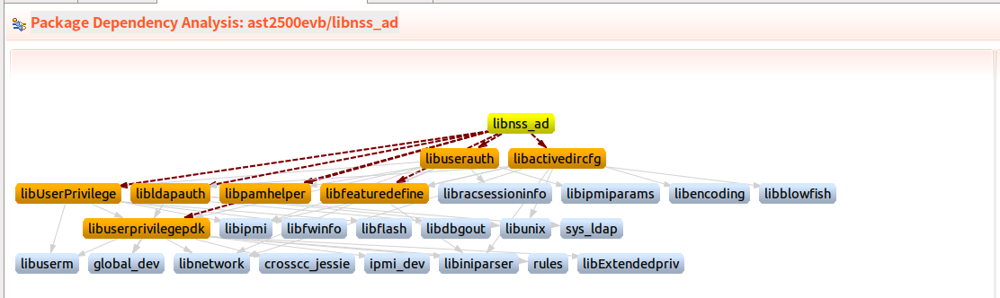

## 命名與描述處理

我想要為libnss_ad寫一個recipe，因此創造一個新檔案命名為libnss-ad.bb
在一個recipe內，會有一些變數來定義這個recipe的用途。

其中最常看到的開頭不外乎就是以下三個變數

```
SUMMARY = "Package Contains implementation for libnss for Active Directory"
SECTION = "libs"
LICENSE = "CLOSED"
```

**SUMMARY**:簡單描述這個recipe的用途

**SECTION**:說明這個recipe是要做成library

**LICENSE**:說明要適用那一個license


## 相依關係處理

有一個範例是這樣的，我想要為libnss_ad寫一個Yocto Recipe而下圖解釋了這個libnss_ad的相依關係，再寫Recipe時也要考慮到相依，因為libnss_ad也會使用或是連結到外部函式或函式庫。

以下圖來說libnss_ad會和libuserauth, libactivedircfg, libuserpriviledge, libldapauth, libpamhelper, libfeaturedefine和libuserpriviledgepdk相依。



在Recipe 內的寫法就要如此

```
DEPENDS = "libuserauth libactivedircfg \
            libuserpriviledge libldapauth libpamhelper libfeaturedefine \
            libuserpriviledgepdk"
RDEPENDS_${PN} = "libuserauth libactivedircfg \
            libuserpriviledge libldapauth libpamhelper libfeaturedefine \
            libuserpriviledgepdk"
```

**DEPENDS**：表示recipe在Build-time時會相依的Library

**RDEPENDS_${PN}**:表示libnss_ad在Run-time時會相依的Library

**${PN}**:PN代表的是recipe name。libnss_ad.bb的PN就是libnss_ad


## Fetch Source與Unpack Source

一個recipe也要定義要從何處來fetch程式碼

```
SRC_URI = ""
```

SRC_URI支援git, svn, ssh, file...

Fetch Source後，也要定義unpack後的Build Directory，這邊是用**S**來定義

```
S = "${WORKDIR}/data"
```

WORKDIR表示一個recipe的Build Directory Path name，其組成如下

```
${TMPDIR}/work/${MULTIMACH_TARGET_SYS}/${PN}/${EXTENDPE}${PV}-${PR} 
```

白話來說libnss_ad在unpack後的程式碼會放在

**build/tmp/work/armv6-openbmc-linux-gnueabi/libnss-nss/1.0-r0/data**


## 額外的設定

```
INSANE_SKIP_${PN} = "dev-so textrel"
INHIBIT_PACKAGE_DEBUG_SPLIT  = "1"
PACKAGES = "${PN} ${PN}-dev"
```

INSANE_SKIP_${PN}: 忽略對symbolic link .so的QA檢查
INHIBIT_PACKAGE_DEBUG_SPLIT: 不需要Debug Information，加快編譯速度。


再來是定義configure, compile, install階段要準備的事情

```
do_configure_prepend() {
	export TOOLDIR=${STAGING_INCDIR}
	export SPXLIB=${STAGING_LIBDIR}
	export TARGETDIR=${STAGING_DIR_TARGET}
	export IMAGE_TREE=${STAGING_DIR_TARGET}
	export PKG_MAJOR=${PKG_MAJOR}
	export PKG_MINOR=${PKG_MINOR}
	export PKG_AUX=${PKG_AUX}
}

do_compile_prepend() {
	export TOOLDIR=${STAGING_INCDIR}
	export SPXLIB=${STAGING_LIBDIR}
	export IMAGE_TREE=${STAGING_DIR_TARGET}
	export TARGETDIR=${D}
	export PKG_MAJOR=${PKG_MAJOR}
	export PKG_MINOR=${PKG_MINOR}
	export PKG_AUX=${PKG_AUX}
}

do_install () {
	install -m 0755 -d ${D}/lib
	cd ${S}
	install ${SOLIB_NAME}.so.${PKG_MAJOR}.${PKG_MINOR}.${PKG_AUX} ${D}/lib
	cd ${D}/lib
	ln -s ${SOLIB_NAME}.so.${PKG_MAJOR}.${PKG_MINOR}.${PKG_AUX} ${SOLIB_NAME}.so.2
}
```

經過這些階段後，library就產生了並在Build Directory先產生將來要放置到rootfs的位置

```
build/tmp/work/armv6-openbmc-linux-gnueabi/libnss-ad/1.0-r0/image$ tree
.
`-- lib
    |-- libnss_ad.so.2 -> libnss_ad.so.6.0.0
    `-- libnss_ad.so.6.0.0

1 directory, 2 files
```

最後是package階段定義什麼檔案要從Build Directory安裝到rootfs

```
FILES_${PN}-dev += ""
FILES_${PN} = "/lib/*"
```

整個recipe要做的大致就是這樣