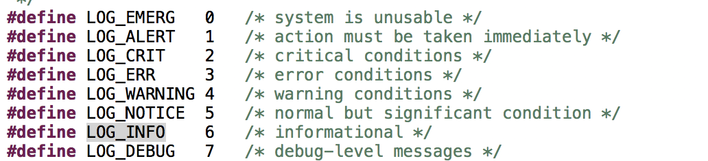
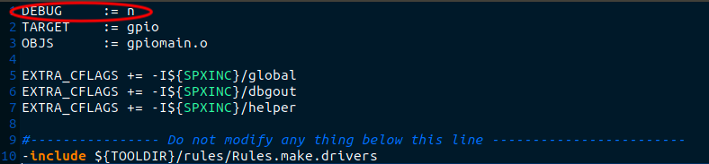
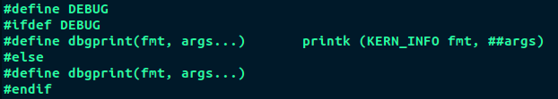

在AMI的程式中常常會見到幾種放在程式中用來顯示資訊或是Debug用，但有些預設是關閉的狀態，需要一些方法才能打開，本文就是研究究竟有哪幾類以及如何去打開。

1. IPMI_INFO, IPMI_WARNING, IPMI_ERROR
   IPMI_XXX後面的後綴字不一樣只是表示syslog level的等級



基本上IPMI_XXX的訊息是會記錄到syslog內的

若是要程式可以支援IPMI_XXX，基本上需要在程式內加標頭檔Debug.h

Makefile要link到程式庫libdbgout


2. DEBUG

   這一種的會定義在每一個package的Makefile內

   表示目前是關掉的，要秀Debug訊息在這個package就必須DEBUG=y
   


而在程式中，就會定義出Debug Message透過dbgprint來顯示，而dbgprint會依照是否有定義DEBUG來決     定。是否要顯示訊息出來



3. TINFO, TWARN, TCRIT
   這三種也是寫到syslog內，同樣的TXXX的不同也只是syslog level的不同而已
   它們是由libdbgout來定義
4. 最後還有一種IPMI_DBG_PRINT, IPMI_DBG_PRINT_X
   這個比較複雜一點，因為它可依照Marco來決定是要寫到syslog還是printf輸出

要使用的方式需要在程式中定義三個Marco

```
_DEBUG_, ENABLE_DEBUG_MACROS, ENABLE_DEBUG_LOG
```


| DEBUG                            | 無定義 | 有定義 | 有定義       | 有定義       | 有定義               |
| -------------------------------- | ------ | ------ | ------------ | ------------ | -------------------- |
| ENABLE_DEBUG_MACROS              | N/a    | 0      | 0            | 1            | 1                    |
| ENABLE_DEBUG_LOG                 | N/a    | 0      | 1            | 0            | 1                    |
|                                  |        |        |              |              |                      |
| IPMI_DBG_PRINT和IPMI_DBG_PRINT_X | 無輸出 | 無輸出 | 輸出到syslog | 輸出到printf | 輸出到syslog和printf |

