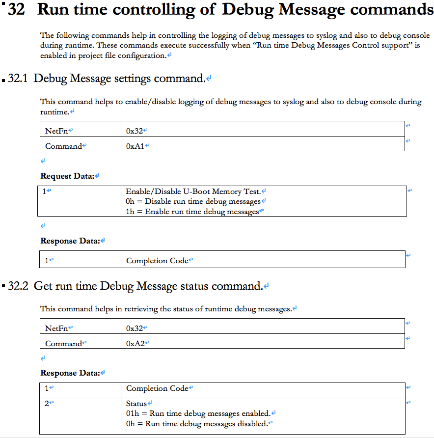

在AMI的SP-X中，可以透過IPMI OEM Command來啟用或關閉Debug messages，這和上篇不太一樣，這是可以動態的打開或關閉Debug message，上篇是用Compile Build time來決定是否要啟用Debug message功能。



關於這個OEM Command的action是定義在libipmiamioemctldbg這包package內。

Get run time Debug Message Status Command的原始碼如下

```
int AMIGetDebugMsgStatus(_NEAR_ INT8U *pReq, INT32U ReqLen, _NEAR_ INT8U *pRes, int BMCInst)
{
    struct stat buff;
    AMIGetDebugMsgStatusRes_T *pAMIGetDebugMsgStatusRes = (AMIGetDebugMsgStatusRes_T *)pRes;
    if(0)
    {
    	ReqLen = ReqLen;   /* -Wextra; Fix for unused parameter */
    	BMCInst = BMCInst;
    	pReq = pReq;
    }
    
    if(g_corefeatures.runtime_dbgmsg_support == ENABLED)
    {
        if(stat(ENABLE_DBG_MSG,&buff) == 0)
        {
            pAMIGetDebugMsgStatusRes->DebugMsgStatus = DEBUG_MSG_ENABLED;
        }
        else
        {
            pAMIGetDebugMsgStatusRes->DebugMsgStatus = DEBUG_MSG_DISABLED;
        }
        pAMIGetDebugMsgStatusRes->CompletionCode = CC_NORMAL;
        return sizeof(AMIGetDebugMsgStatusRes_T);
    }
    else
    {
        *pRes = CC_INV_CMD;
        return sizeof(*pRes);
    }
    
}

```

要能正常執行的條件是
**g_corefeatures.runtime_dbgmsg_support == ENABLED**
這個特性是在AMI的MDS內要打開CONFIG_SPX_FEATURE_RUN_TIME_DBG_MSG_SUPPORT才能使用這個OEM Command

**if(stat(ENABLE_DBG_MSG,&buff) == 0)**
這是檢查是否/var/enable.dbgmsg這個檔案存在，如果這個檔案不存在，還是無法讓你使用Get run time Debug Message Status Command。

而這個檔案/var/enable.dbgmsg什麼時候產生？當執行Debug Message Settings command並啟用時，就在此時會產生這個檔案而關閉時則會刪除這個檔案。

```
int AMIControlDebugMsg(_NEAR_ INT8U *pReq, INT32U ReqLen, _NEAR_ INT8U *pRes, int BMCInst)
{
    AMIControlDebugMsgReq_T *pAMIControlDebugMsgReq = (AMIControlDebugMsgReq_T *)pReq;
    AMIControlDebugMsgRes_T *pAMIControlDebugMsgRes = (AMIControlDebugMsgRes_T*)pRes;
    if(0)
    {
    	ReqLen = ReqLen;   /* -Wextra; Fix for unused parameter */
    	BMCInst = BMCInst;
    }

    if(g_corefeatures.runtime_dbgmsg_support == ENABLED)
    {
        pAMIControlDebugMsgRes->CompletionCode = CC_NORMAL;
        if(pAMIControlDebugMsgReq->CtrlDebugMsg == 1)
        {
            touch(ENABLE_DBG_MSG);
            pAMIControlDebugMsgRes->DebugMsgStatus = DEBUG_MSG_ENABLED;
        }
        else if(pAMIControlDebugMsgReq->CtrlDebugMsg == 0)
        {
            if(unlink(ENABLE_DBG_MSG) != 0)
            {
            	TCRIT("Unlink failed\n");
            }
            pAMIControlDebugMsgRes->DebugMsgStatus = DEBUG_MSG_DISABLED;
        }
        else
        {
            pAMIControlDebugMsgRes->CompletionCode = CC_INV_DATA_FIELD;
        }
        return sizeof(AMIControlDebugMsgRes_T);
    }
    else
    {
        *pRes = CC_INV_CMD;
        return sizeof(*pRes);
    }
}
```


而使用ipmi command啟用後，程式怎麼去開啟輸出Debug Message

當SPX內有使用到TDBG()，此時的內容就可以被顯現出來。

Tarce TDBG()

```
#define TDBG(fmt,args...)    PLATFORM_DBGRUNOUTFN(LOG_DEBUG,TDBG_FILE_LINE_FMT fmt,TDBG_FILENAME,TDBG_LINENO,##args)
```

TDBG -> PLATFORM_DBGRUNOUTFN -> IDBG_LINUXAPP_Runtime_DbgOut

```
#define PLATFORM_DBGRUNOUTFN(n,fmt,args...)   IDBG_LINUXAPP_Runtime_DbgOut(TDBG_AMI_APP_FACILITY | n,fmt,##args)
```


IDBG_LINUXAPP_Runtime_DbgOut的原型定義在libdbgout內

```
void IDBG_LINUXAPP_Runtime_DbgOut(int nLevel, const char* lpszFormat,...)
/*@globals internalState, fileSystem, gAlreadyInited, gPristrings, gLogAlso@*/
/*@modifies internalState, gAlreadyInited@*/
{
    int nBufHeader;
    char szBuffer[2048];
    va_list args;
    struct stat buff;

    if(!gAlreadyInited)
        IDBG_LINUXAPP_DbgInit();

    if(nLevel == LOG_DBG_LEVEL)
    {
        if(stat(ENABLE_DBG_MSG,&buff) != 0)
            return;
    }

    va_start(args, lpszFormat);


    /**Put some leads in the string**/
    nBufHeader = snprintf(szBuffer,sizeof(szBuffer)-1,
                          "[%d : %d %s]",(int)getpid(),(int)gettid(),gPristrings[LOG_PRI(nLevel)]);


    vsnprintf(szBuffer+nBufHeader, sizeof(szBuffer)-nBufHeader, lpszFormat, args);

    fprintf(stderr,"%s\n",szBuffer);

    if(gLogAlso)
    {
        syslog(nLevel,"%s",szBuffer);
    }


    va_end(args);
}
```

